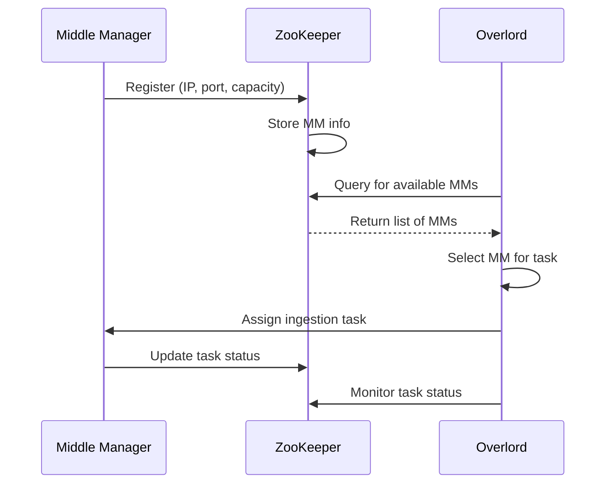

Here's how ZooKeeper helps in service discovery, particularly between the Overlord and Middle Managers:

1. Registration:
   - When a Middle Manager starts up, it registers itself with ZooKeeper.
   - The registration includes information like its IP address, port, and available capacity.
   - This information is stored in a specific path in ZooKeeper's hierarchical namespace, typically something like `/druid/middlemanagers`.

2. Discovery:
   - When the Overlord needs to assign a task, it queries ZooKeeper.
   - It looks up the `/druid/middlemanagers` path to get a list of all registered Middle Managers.
   - This list includes the connection details and capacities of each Middle Manager.

3. Selection:
   - The Overlord uses the information from ZooKeeper to select an appropriate Middle Manager for the task.
   - It might consider factors like current load, capacity, or use a round-robin approach.

4. Task Assignment:
   - Once a Middle Manager is selected, the Overlord can directly communicate with it using the connection details provided by ZooKeeper.
   - The Overlord assigns the ingestion task to the chosen Middle Manager.

5. Status Updates:
   - As the task progresses, the Middle Manager updates its status in ZooKeeper.
   - The Overlord can monitor these updates by watching the relevant ZooKeeper paths.

6. Dynamic Updates:
   - If a new Middle Manager joins the cluster, it registers with ZooKeeper.
   - The Overlord will see this new node in its next query to ZooKeeper.
   - Similarly, if a Middle Manager goes offline, its ephemeral node in ZooKeeper will disappear.

7. Heartbeats:
   - Middle Managers periodically send heartbeats to ZooKeeper to maintain their "alive" status.
   - If a Middle Manager fails to send heartbeats, ZooKeeper can remove its registration, informing the Overlord that the node is no longer available.

This mechanism allows for a dynamic, scalable cluster where nodes can be added or removed without manual reconfiguration. The Overlord doesn't need to know the exact location of Middle Managers in advance; it can discover them at runtime through ZooKeeper.
